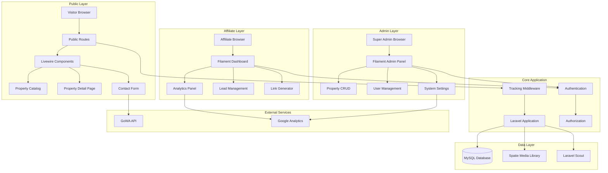
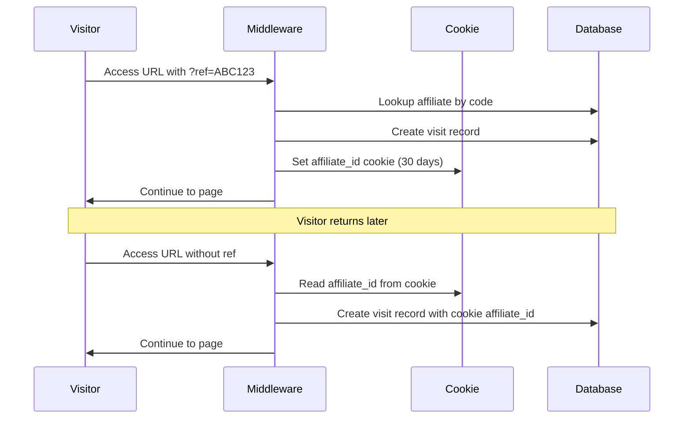
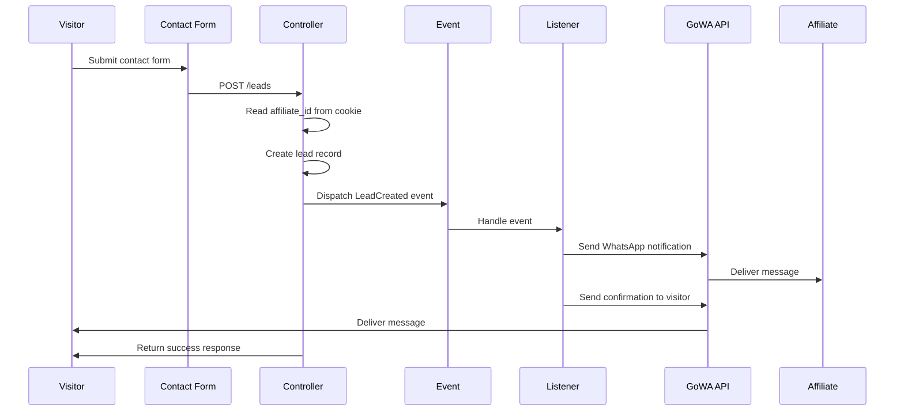
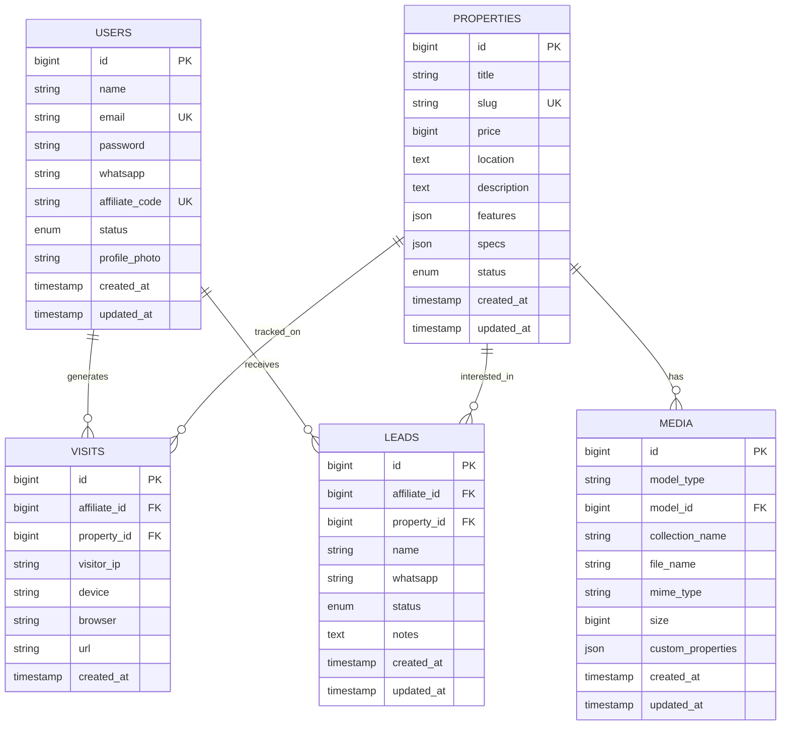

# Design Document

## Overview

The Property Affiliate Management System (PAMS) is built on Laravel 12 with FilamentPHP v4 for admin interfaces and Livewire 3 for interactive frontend components. The architecture follows a modular MVC pattern with clear separation between admin panel, affiliate dashboard, and public-facing catalog. The system implements cookie-based affiliate tracking, real-time WhatsApp notifications via GoWA API, and hybrid analytics combining internal database metrics with Google Analytics.

### Key Design Principles

- **Separation of Concerns**: Admin, affiliate, and public interfaces are isolated with distinct routing and middleware
- **Performance First**: Eager loading, query optimization, and image optimization for fast page loads
- **Scalability**: JSON-based flexible schemas for property attributes to accommodate diverse property types
- **Security**: Role-based access control with Filament Shield, CSRF protection, and input validation
- **Tracking Accuracy**: Cookie persistence with 30-day expiration ensures reliable affiliate attribution

## Architecture

### High-Level System Architecture



### Technology Stack Layers

1. **Presentation Layer**
   - FilamentPHP v4: Admin and affiliate dashboards
   - Livewire 3: Interactive public catalog components
   - Blade Templates: Server-side rendering
   - TailwindCSS: Styling framework

2. **Application Layer**
   - Laravel 12: Core framework
   - Custom Middleware: Affiliate tracking logic
   - Event System: Lead notification triggers
   - Service Classes: Business logic encapsulation

3. **Data Layer**
   - MySQL 8.0+: Primary database
   - Eloquent ORM: Database abstraction
   - Laravel Scout: Search indexing
   - Spatie Media Library: File management

4. **Integration Layer**
   - GoWA API: WhatsApp notifications
   - Google Analytics: Traffic analytics
   - Laravel Sanctum: API authentication (future)

## Components and Interfaces

### 1. Property Management Module

**Purpose**: Complete CRUD operations for property listings

**Components**:
- `PropertyResource` (Filament): Admin interface for property management
- `Property` Model: Eloquent model with media relationships
- `PropertyController`: Public API for property display
- `PropertySeeder`: Sample data generation

**Key Interfaces**:

```php
// Property Model
class Property extends Model
{
    protected $fillable = [
        'title', 'slug', 'price', 'location', 
        'description', 'features', 'specs', 'status'
    ];
    
    protected $casts = [
        'features' => 'array',
        'specs' => 'json',
        'price' => 'integer'
    ];
    
    // Relationships
    public function leads(): HasMany;
    public function visits(): HasMany;
    
    // Scopes
    public function scopePublished($query);
    public function scopeAvailable($query);
    
    // Accessors
    public function getFormattedPriceAttribute(): string;
}
```

**Filament Resource Configuration**:
- Form: Text inputs, rich text editor, JSON repeater for features, key-value repeater for specs
- Table: Columns for title, price, status with filters and search
- Media: SpatieMediaLibraryFileUpload for image management
- Validation: Required fields, unique slug, price minimum value

### 2. Affiliate Tracking Module

**Purpose**: Track visitor activity and attribute leads to affiliates

**Components**:
- `AffiliateTrackingMiddleware`: Cookie and visit recording logic
- `Visit` Model: Store visit records
- `AffiliateCodeGenerator`: Generate unique affiliate codes
- `TrackingService`: Business logic for attribution

**Tracking Flow**:



**Key Interfaces**:

```php
// Middleware
class AffiliateTrackingMiddleware
{
    public function handle(Request $request, Closure $next)
    {
        // Check for ref parameter
        if ($request->has('ref')) {
            $affiliate = User::where('affiliate_code', $request->ref)->first();
            if ($affiliate) {
                Cookie::queue('affiliate_id', $affiliate->id, 43200); // 30 days
                $this->recordVisit($affiliate->id, $request);
            }
        } 
        // Check for existing cookie
        elseif ($request->cookie('affiliate_id')) {
            $this->recordVisit($request->cookie('affiliate_id'), $request);
        }
        
        return $next($request);
    }
    
    private function recordVisit(int $affiliateId, Request $request): void;
}

// Visit Model
class Visit extends Model
{
    protected $fillable = [
        'affiliate_id', 'visitor_ip', 'device', 
        'browser', 'url', 'property_id'
    ];
    
    public function affiliate(): BelongsTo;
    public function property(): BelongsTo;
}
```

### 3. Lead Management Module

**Purpose**: Capture and manage prospective buyer information

**Components**:
- `LeadResource` (Filament): Affiliate interface for lead management
- `Lead` Model: Store lead data
- `LeadController`: Handle form submissions
- `LeadCreated` Event: Trigger notifications
- `SendLeadNotification` Listener: WhatsApp integration

**Lead Capture Flow**:



**Key Interfaces**:

```php
// Lead Model
class Lead extends Model
{
    protected $fillable = [
        'affiliate_id', 'property_id', 'name', 
        'whatsapp', 'status', 'notes'
    ];
    
    protected $casts = [
        'status' => LeadStatus::class
    ];
    
    public function affiliate(): BelongsTo;
    public function property(): BelongsTo;
    
    // Status transitions
    public function markAsFollowUp(): void;
    public function markAsSurvey(): void;
    public function markAsClosed(): void;
    public function markAsLost(): void;
}

// Lead Status Enum
enum LeadStatus: string
{
    case NEW = 'new';
    case FOLLOW_UP = 'follow_up';
    case SURVEY = 'survey';
    case CLOSED = 'closed';
    case LOST = 'lost';
}

// Event
class LeadCreated
{
    public function __construct(
        public Lead $lead
    ) {}
}

// Listener
class SendLeadNotification
{
    public function handle(LeadCreated $event): void
    {
        $lead = $event->lead;
        
        // Send to affiliate
        if ($lead->affiliate) {
            $this->sendToAffiliate($lead);
        }
        
        // Send confirmation to visitor
        $this->sendToVisitor($lead);
    }
    
    private function sendToAffiliate(Lead $lead): void;
    private function sendToVisitor(Lead $lead): void;
}
```

### 4. WhatsApp Notification Module

**Purpose**: Send real-time notifications via GoWA API

**Components**:
- `GoWAService`: API client wrapper
- `WhatsAppNotification`: Notification class
- Configuration: API credentials in .env

**Key Interfaces**:

```php
// Service Class
class GoWAService
{
    private string $apiKey;
    private string $apiUrl;
    
    public function __construct()
    {
        $this->apiKey = config('services.gowa.api_key');
        $this->apiUrl = config('services.gowa.api_url');
    }
    
    public function sendMessage(string $phone, string $message): bool
    {
        try {
            $response = Http::withHeaders([
                'Authorization' => 'Bearer ' . $this->apiKey
            ])->post($this->apiUrl . '/send', [
                'phone' => $this->formatPhone($phone),
                'message' => $message
            ]);
            
            return $response->successful();
        } catch (\Exception $e) {
            Log::error('GoWA API Error: ' . $e->getMessage());
            return false;
        }
    }
    
    private function formatPhone(string $phone): string;
}

// Configuration (config/services.php)
'gowa' => [
    'api_key' => env('GOWA_API_KEY'),
    'api_url' => env('GOWA_API_URL', 'https://api.gowa.id/v1'),
],
```

### 5. Analytics Module

**Purpose**: Provide performance metrics for affiliates and admins

**Components**:
- `AffiliateAnalyticsWidget` (Filament): Dashboard widgets
- `AnalyticsService`: Calculate metrics from database
- `GoogleAnalyticsWidget`: Embed GA charts
- `VisitRepository`: Query optimization for analytics

**Key Metrics**:
- Total visits (today, this week, this month)
- Total leads (today, this week, this month)
- Conversion rate (leads / visits)
- Device breakdown (mobile vs desktop)
- Top performing properties
- Lead status distribution

**Key Interfaces**:

```php
// Analytics Service
class AnalyticsService
{
    public function getAffiliateMetrics(User $affiliate, Carbon $startDate, Carbon $endDate): array
    {
        return [
            'total_visits' => $this->getTotalVisits($affiliate, $startDate, $endDate),
            'total_leads' => $this->getTotalLeads($affiliate, $startDate, $endDate),
            'conversion_rate' => $this->getConversionRate($affiliate, $startDate, $endDate),
            'device_breakdown' => $this->getDeviceBreakdown($affiliate, $startDate, $endDate),
            'top_properties' => $this->getTopProperties($affiliate, $startDate, $endDate),
        ];
    }
    
    public function getGlobalMetrics(Carbon $startDate, Carbon $endDate): array;
    
    private function getTotalVisits(User $affiliate, Carbon $startDate, Carbon $endDate): int;
    private function getTotalLeads(User $affiliate, Carbon $startDate, Carbon $endDate): int;
    private function getConversionRate(User $affiliate, Carbon $startDate, Carbon $endDate): float;
    private function getDeviceBreakdown(User $affiliate, Carbon $startDate, Carbon $endDate): array;
    private function getTopProperties(User $affiliate, Carbon $startDate, Carbon $endDate): Collection;
}
```

### 6. User Management Module

**Purpose**: Handle user registration, authentication, and role assignment

**Components**:
- `UserResource` (Filament): Admin interface for user management
- `User` Model: Extended with affiliate-specific fields
- `RegisterController`: Handle affiliate registration
- Filament Shield: Role and permission management

**User Roles**:
- **Super Admin**: Full system access
- **Affiliate**: Limited to own dashboard and leads

**Key Interfaces**:

```php
// User Model
class User extends Authenticatable
{
    protected $fillable = [
        'name', 'email', 'password', 'whatsapp',
        'affiliate_code', 'status', 'profile_photo'
    ];
    
    protected $casts = [
        'status' => UserStatus::class
    ];
    
    // Relationships
    public function visits(): HasMany;
    public function leads(): HasMany;
    
    // Scopes
    public function scopeAffiliates($query);
    public function scopePending($query);
    public function scopeActive($query);
    
    // Methods
    public function generateAffiliateCode(): string;
    public function approve(): void;
    public function block(): void;
}

// User Status Enum
enum UserStatus: string
{
    case PENDING = 'pending';
    case ACTIVE = 'active';
    case BLOCKED = 'blocked';
}
```

### 7. Public Catalog Module

**Purpose**: Display property listings to visitors with search and filtering

**Components**:
- `PropertyCatalog` (Livewire): Main catalog component
- `PropertyDetail` (Livewire): Property detail page
- `PropertySearch` (Livewire): Search and filter component
- `ContactForm` (Livewire): Lead capture form

**Key Interfaces**:

```php
// Livewire Component
class PropertyCatalog extends Component
{
    public string $search = '';
    public array $filters = [];
    public string $sortBy = 'newest';
    
    public function render()
    {
        $properties = Property::published()
            ->when($this->search, fn($q) => $q->search($this->search))
            ->when($this->filters, fn($q) => $this->applyFilters($q))
            ->orderBy($this->getSortColumn(), $this->getSortDirection())
            ->paginate(12);
            
        return view('livewire.property-catalog', compact('properties'));
    }
    
    public function applyFilters($query);
    private function getSortColumn(): string;
    private function getSortDirection(): string;
}

// Property Detail Component
class PropertyDetail extends Component
{
    public Property $property;
    
    public function mount(string $slug)
    {
        $this->property = Property::published()
            ->where('slug', $slug)
            ->with('media')
            ->firstOrFail();
    }
    
    public function render()
    {
        return view('livewire.property-detail');
    }
}

// Contact Form Component
class ContactForm extends Component
{
    public Property $property;
    public string $name = '';
    public string $whatsapp = '';
    
    protected $rules = [
        'name' => 'required|string|max:255',
        'whatsapp' => 'required|string|regex:/^[0-9]{10,15}$/'
    ];
    
    public function submit()
    {
        $this->validate();
        
        $affiliateId = request()->cookie('affiliate_id');
        
        $lead = Lead::create([
            'affiliate_id' => $affiliateId,
            'property_id' => $this->property->id,
            'name' => $this->name,
            'whatsapp' => $this->whatsapp,
            'status' => LeadStatus::NEW
        ]);
        
        event(new LeadCreated($lead));
        
        session()->flash('success', 'Terima kasih! Kami akan segera menghubungi Anda.');
        $this->reset(['name', 'whatsapp']);
    }
}
```

### 8. SEO Module

**Purpose**: Optimize property pages for search engines and social sharing

**Components**:
- `SeoService`: Generate meta tags
- `SitemapGenerator`: Create XML sitemap
- `OpenGraphService`: Generate OG tags
- Scheduled Command: Update sitemap daily

**Key Interfaces**:

```php
// SEO Service
class SeoService
{
    public function generateMetaTags(Property $property): array
    {
        return [
            'title' => $this->generateTitle($property),
            'description' => $this->generateDescription($property),
            'keywords' => $this->generateKeywords($property),
            'og:title' => $property->title,
            'og:description' => Str::limit($property->description, 200),
            'og:image' => $property->getFirstMediaUrl('images'),
            'og:url' => route('property.show', $property->slug),
        ];
    }
    
    private function generateTitle(Property $property): string;
    private function generateDescription(Property $property): string;
    private function generateKeywords(Property $property): array;
}

// Sitemap Command
class GenerateSitemap extends Command
{
    public function handle()
    {
        SitemapGenerator::create(config('app.url'))
            ->add(Property::published()->get())
            ->writeToFile(public_path('sitemap.xml'));
    }
}
```

## Data Models

### Entity Relationship Diagram



### Database Schema Details

**users table**:
```sql
CREATE TABLE users (
    id BIGINT UNSIGNED AUTO_INCREMENT PRIMARY KEY,
    name VARCHAR(255) NOT NULL,
    email VARCHAR(255) UNIQUE NOT NULL,
    password VARCHAR(255) NOT NULL,
    whatsapp VARCHAR(20),
    affiliate_code VARCHAR(50) UNIQUE,
    status ENUM('pending', 'active', 'blocked') DEFAULT 'pending',
    profile_photo VARCHAR(255),
    created_at TIMESTAMP NULL,
    updated_at TIMESTAMP NULL,
    INDEX idx_affiliate_code (affiliate_code),
    INDEX idx_status (status)
);
```

**properties table**:
```sql
CREATE TABLE properties (
    id BIGINT UNSIGNED AUTO_INCREMENT PRIMARY KEY,
    title VARCHAR(255) NOT NULL,
    slug VARCHAR(255) UNIQUE NOT NULL,
    price BIGINT UNSIGNED NOT NULL,
    location TEXT NOT NULL,
    description TEXT,
    features JSON,
    specs JSON,
    status ENUM('draft', 'published', 'sold') DEFAULT 'draft',
    created_at TIMESTAMP NULL,
    updated_at TIMESTAMP NULL,
    INDEX idx_slug (slug),
    INDEX idx_status (status),
    INDEX idx_price (price),
    FULLTEXT idx_search (title, location, description)
);
```

**leads table**:
```sql
CREATE TABLE leads (
    id BIGINT UNSIGNED AUTO_INCREMENT PRIMARY KEY,
    affiliate_id BIGINT UNSIGNED NULL,
    property_id BIGINT UNSIGNED NOT NULL,
    name VARCHAR(255) NOT NULL,
    whatsapp VARCHAR(20) NOT NULL,
    status ENUM('new', 'follow_up', 'survey', 'closed', 'lost') DEFAULT 'new',
    notes TEXT,
    created_at TIMESTAMP NULL,
    updated_at TIMESTAMP NULL,
    FOREIGN KEY (affiliate_id) REFERENCES users(id) ON DELETE SET NULL,
    FOREIGN KEY (property_id) REFERENCES properties(id) ON DELETE CASCADE,
    INDEX idx_affiliate_id (affiliate_id),
    INDEX idx_property_id (property_id),
    INDEX idx_status (status),
    INDEX idx_created_at (created_at)
);
```

**visits table**:
```sql
CREATE TABLE visits (
    id BIGINT UNSIGNED AUTO_INCREMENT PRIMARY KEY,
    affiliate_id BIGINT UNSIGNED NOT NULL,
    property_id BIGINT UNSIGNED NULL,
    visitor_ip VARCHAR(45),
    device VARCHAR(50),
    browser VARCHAR(50),
    url TEXT,
    created_at TIMESTAMP NULL,
    FOREIGN KEY (affiliate_id) REFERENCES users(id) ON DELETE CASCADE,
    FOREIGN KEY (property_id) REFERENCES properties(id) ON DELETE SET NULL,
    INDEX idx_affiliate_id (affiliate_id),
    INDEX idx_property_id (property_id),
    INDEX idx_created_at (created_at)
);
```

## Error Handling

### Error Handling Strategy

1. **Validation Errors**
   - Use Laravel Form Requests for input validation
   - Return user-friendly error messages
   - Display errors inline in Filament forms
   - Log validation failures for security monitoring

2. **External API Failures**
   - Wrap GoWA API calls in try-catch blocks
   - Log errors with context (lead ID, phone number)
   - Continue application flow even if notification fails
   - Implement retry mechanism with exponential backoff
   - Provide admin notification for repeated failures

3. **Database Errors**
   - Use database transactions for multi-step operations
   - Implement proper foreign key constraints
   - Log query errors with stack traces
   - Display generic error messages to users
   - Provide detailed errors in logs for debugging

4. **Authentication & Authorization Errors**
   - Return 401 for unauthenticated requests
   - Return 403 for unauthorized access attempts
   - Log suspicious access attempts
   - Redirect to login page with return URL
   - Display clear permission denied messages

5. **File Upload Errors**
   - Validate file types and sizes before upload
   - Handle storage failures gracefully
   - Clean up partial uploads on failure
   - Display specific error messages (file too large, invalid type)
   - Log upload errors with user context

### Error Response Format

```php
// API Error Response
{
    "success": false,
    "message": "User-friendly error message",
    "errors": {
        "field_name": ["Specific validation error"]
    },
    "code": "ERROR_CODE"
}

// Exception Handler
class Handler extends ExceptionHandler
{
    public function render($request, Throwable $exception)
    {
        if ($exception instanceof ValidationException) {
            return $this->handleValidationException($request, $exception);
        }
        
        if ($exception instanceof AuthorizationException) {
            return $this->handleAuthorizationException($request, $exception);
        }
        
        if ($exception instanceof ModelNotFoundException) {
            return $this->handleNotFoundException($request, $exception);
        }
        
        // Log unexpected errors
        Log::error('Unexpected error', [
            'exception' => get_class($exception),
            'message' => $exception->getMessage(),
            'trace' => $exception->getTraceAsString()
        ]);
        
        return parent::render($request, $exception);
    }
}
```

## Testing Strategy

### Testing Pyramid

1. **Unit Tests** (60%)
   - Model methods and relationships
   - Service class business logic
   - Helper functions and utilities
   - Validation rules
   - Data transformations

2. **Feature Tests** (30%)
   - API endpoints
   - Form submissions
   - Authentication flows
   - Authorization checks
   - Database interactions

3. **Integration Tests** (10%)
   - External API integrations (GoWA)
   - Email/notification delivery
   - File upload and storage
   - Search functionality
   - Complete user workflows

### Key Test Cases

**Property Management**:
- Create property with valid data
- Update property with media uploads
- Delete property and cascade relationships
- Validate required fields and data types
- Test slug generation and uniqueness
- Test status transitions

**Affiliate Tracking**:
- Record visit with ref parameter
- Set cookie with correct expiration
- Read affiliate from existing cookie
- Handle invalid affiliate codes
- Test visit attribution accuracy
- Test concurrent visit recording

**Lead Management**:
- Create lead from contact form
- Trigger WhatsApp notification event
- Handle missing affiliate cookie
- Update lead status transitions
- Test lead assignment to affiliate
- Validate phone number format

**Authentication & Authorization**:
- User registration and approval flow
- Login with valid credentials
- Access control for different roles
- Prevent unauthorized resource access
- Test session management
- Test password reset flow

**Analytics**:
- Calculate metrics accurately
- Handle date range queries
- Test aggregation functions
- Verify conversion rate calculations
- Test device breakdown accuracy
- Test performance with large datasets

### Testing Tools

- **PHPUnit**: Core testing framework
- **Laravel Dusk**: Browser testing for Livewire components
- **Pest**: Alternative syntax for cleaner tests
- **Mockery**: Mocking external dependencies
- **Factory**: Generate test data
- **Database Transactions**: Rollback after each test

### Continuous Integration

- Run tests on every commit
- Enforce code coverage minimum (80%)
- Run static analysis (PHPStan, Larastan)
- Check code style (Laravel Pint)
- Test on multiple PHP versions (8.3, 8.4)

## Performance Considerations

### Database Optimization

- Index frequently queried columns (affiliate_code, slug, status)
- Use eager loading to prevent N+1 queries
- Implement query result caching for analytics
- Partition visits table by date for large datasets
- Use database views for complex analytics queries

### Caching Strategy

- Cache property listings (5 minutes)
- Cache affiliate analytics (15 minutes)
- Cache sitemap (24 hours)
- Use Redis for session and cache storage
- Implement cache tags for selective invalidation

### Image Optimization

- Generate responsive image sizes (thumbnail, medium, large)
- Convert images to WebP format
- Lazy load images below the fold
- Use CDN for media delivery
- Implement image compression on upload

### Frontend Performance

- Minimize JavaScript bundle size
- Use Livewire wire:loading for better UX
- Implement pagination for large lists
- Use debouncing for search inputs
- Optimize CSS with PurgeCSS

## Security Considerations

### Input Validation

- Validate all user inputs server-side
- Sanitize HTML content in descriptions
- Validate file uploads (type, size, content)
- Use prepared statements (Eloquent ORM)
- Implement rate limiting on forms

### Authentication & Authorization

- Use bcrypt for password hashing
- Implement CSRF protection on all forms
- Use Filament Shield for granular permissions
- Enforce strong password requirements
- Implement account lockout after failed attempts

### Data Protection

- Encrypt sensitive data at rest
- Use HTTPS for all connections
- Implement proper session management
- Sanitize output to prevent XSS
- Validate and sanitize URLs

### API Security

- Use Laravel Sanctum for API authentication
- Implement rate limiting on API endpoints
- Validate API tokens on every request
- Log all API access attempts
- Implement IP whitelisting for admin API

## Deployment Architecture

### Production Environment

- **Web Server**: Nginx with PHP-FPM
- **Application**: Laravel 12 on PHP 8.3
- **Database**: MySQL 8.0 with replication
- **Cache**: Redis for sessions and cache
- **Queue**: Redis for job processing
- **Storage**: S3-compatible object storage for media
- **CDN**: CloudFlare for static assets

### Deployment Process

1. Run tests in CI/CD pipeline
2. Build production assets (npm run build)
3. Deploy code to staging environment
4. Run database migrations
5. Clear and warm up caches
6. Run smoke tests on staging
7. Deploy to production with zero downtime
8. Monitor error logs and performance metrics

### Monitoring & Logging

- Application logs: Laravel Log (daily rotation)
- Error tracking: Sentry or Bugsnag
- Performance monitoring: New Relic or DataDog
- Uptime monitoring: Pingdom or UptimeRobot
- Analytics: Google Analytics + internal metrics
